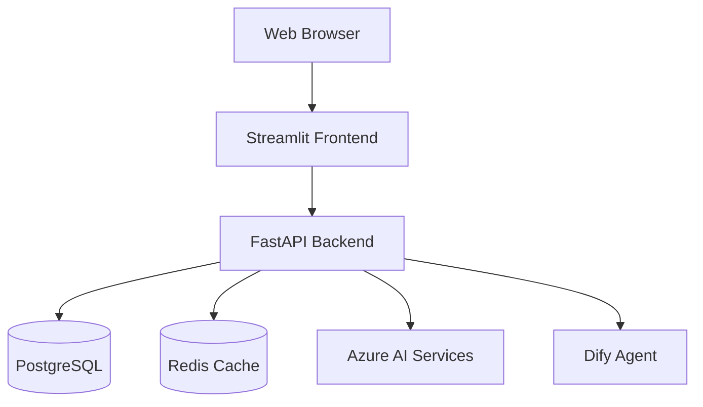
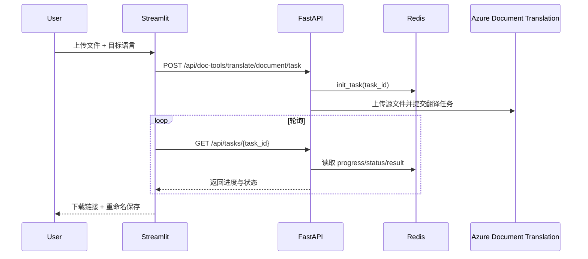
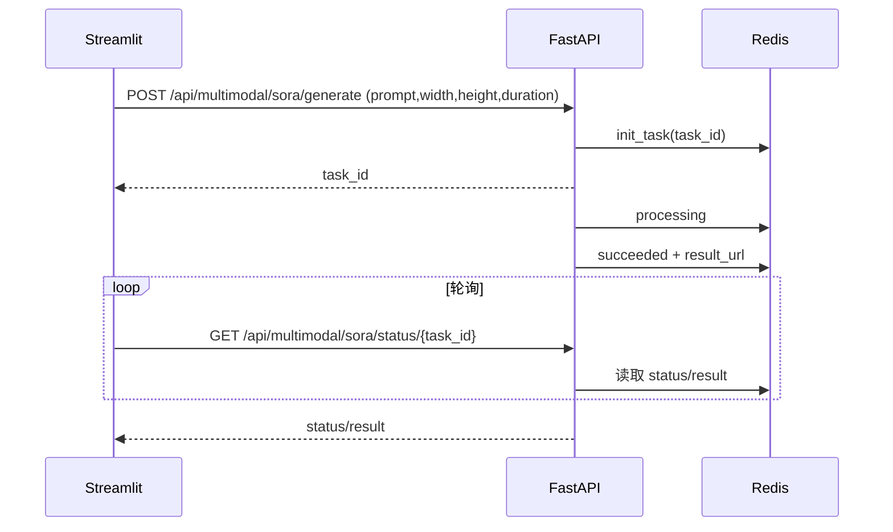

# 🚀 AI Console - 企业级智能增效平台

**AI Console** 是一个集成了多种前沿 AI 能力的企业级服务平台，旨在通过智能化工具提升企业文档处理、合同审查及多模态交互的效率。

## 📋 项目简介

平台采用 **Streamlit** + **FastAPI** 的前后端分离架构，提供直观的 Web 界面和强大的 RESTful API。

### ✨ 核心特性

*   **🌐 文档工具**: 集成 Azure 云端翻译与本地大模型翻译，支持 Word/PDF 等多格式文档处理及自动编号。
*   **⚖️ 合同助手**: 智能审查合同风险、合规性检查及文档差异比对。
*   **🤖 智能体集成**: 接入 Dify 智能体与本地模型，支持多模态对话。
*   **👁️ 多模态应用**: 提供图片智能识别与 Sora 视频生成模拟功能。
*   **🔐 安全可靠**: 完善的用户认证（JWT）、权限管理及操作日志。

## 🏗️ 架构概览



*   **Frontend**: Streamlit, Python
*   **Backend**: FastAPI, SQLAlchemy, Pydantic
*   **Infrastructure**: Docker, Docker Compose, Redis, PostgreSQL

## 🧩 架构细节

### 1) 前端（Streamlit）

*   入口：`AI_Console/frontend/src/main.py`
*   页面组织：`AI_Console/frontend/src/views/**`（按业务域拆分：文档工具 / 合同助手 / 智能体 / 多模态 / 自动化 / 管理员）
*   API 调用：`AI_Console/frontend/src/services/api_client.py` 统一注入 JWT Token，并支持 `form-data` 与 `json` 两种请求方式
*   典型交互模式：
    *   同步下载：上传文件 → 后端返回文件流 → 前端提供重命名输入框 → 下载
    *   异步任务：提交任务 → 获取 `task_id` → 轮询状态接口 → 展示进度与结果（例如云端翻译、Sora 模拟任务）

### 2) 后端（FastAPI）

*   应用入口：`AI_Console/backend/app/main.py`
*   路由层：`AI_Console/backend/app/api/**`
    *   文档工具：`app/api/doc_tools.py`
    *   合同助手：`app/api/contract.py`
    *   多模态：`app/api/multimodal.py`
    *   任务查询：`app/api/tasks.py`
*   业务层：`AI_Console/backend/app/services/**`
    *   文档翻译：`app/services/translator.py`
    *   Azure 调用封装：`app/services/azure_ai.py`、`app/services/azure_translator.py`
    *   合同审查：`app/services/reviewer.py`
    *   Sora 模拟任务：`app/services/media_gen.py`
*   文档解析与回写：`AI_Console/backend/app/utils/doc_parsers.py`（DOCX/XLSX/PPTX 的“拆分-翻译-重建”）

### 3) 认证与权限

*   登录获取 JWT：前端通过表单提交用户名/密码，后端签发 token
*   受保护路由：后端在路由层统一依赖 `get_current_user`，未登录请求会返回 401
*   管理员能力：前端根据 `is_admin` 控制管理员控制台入口展示

### 4) 异步任务与进度

*   任务状态存储：Redis（用于任务 `status/progress/result` 等字段）
*   查询方式：前端轮询任务状态接口，实时刷新进度条与状态文本
*   典型状态：
    *   文档翻译（云端）：`pending → processing → completed/failed`
    *   Sora（模拟）：`pending → processing → succeeded/failed`

### 5) 关键流程示意

**云端文档翻译（异步）**



**Sora 视频生成（模拟）**



## 🚀 快速开始

### 1. 环境要求

*   Docker & Docker Compose
*   Python 3.10+ (若本地运行)

### 2. 启动服务

使用 Docker Compose 一键启动所有服务：

```bash
cd AI_Console
docker-compose up -d
```

启动后访问：
*   **前端 UI**: [http://localhost:8501](http://localhost:8501)
*   **后端 API 文档**: [http://localhost:8000/docs](http://localhost:8000/docs)

### 3. 默认账号

*   **管理员**: `admin` / `admin123456` (或查看数据库初始化配置)

## 🎯 功能模块详情

### 📂 文档工具 (Doc Tools)
*   **云端文档翻译**: 基于 Azure Translation 服务，支持保留文档格式。
*   **本地模型翻译**: 利用本地部署的大语言模型进行隐私文档翻译。
*   **文档自动编号**: 智能解析文档结构，自动重排章节编号。

### ⚖️ 合同助手 (Contract Assistant)
*   **合同智能初审**: 自动识别合同中的风险条款并给出修改建议。
*   **标书合规审查**: 针对标书文件进行关键要素抽取与合规性检查。
*   **文档智能比对**: 基于语义分词的文档差异高亮比对。

### 🤖 智能体与多模态
*   **Dify 智能体**: 集成企业知识库的智能问答助手。
*   **图片智能识别**: 解析上传图片内容，生成详细描述。
*   **Sora 视频生成**: 模拟文生视频任务流，支持异步任务状态轮询。

## 📁 目录结构

```
AI_Console/
├── backend/                # FastAPI 后端
│   ├── app/
│   │   ├── api/            # API 路由定义
│   │   ├── services/       # 业务逻辑实现
│   │   ├── models/         # 数据库模型
│   │   └── core/           # 核心配置
│   └── Dockerfile
├── frontend/               # Streamlit 前端
│   ├── src/
│   │   ├── views/          # 页面视图组件
│   │   └── services/       # API 客户端
│   └── Dockerfile
├── docker-compose.yml      # 容器编排配置
└── README.md               # 项目文档
```

## 📝 许可证

MIT License
